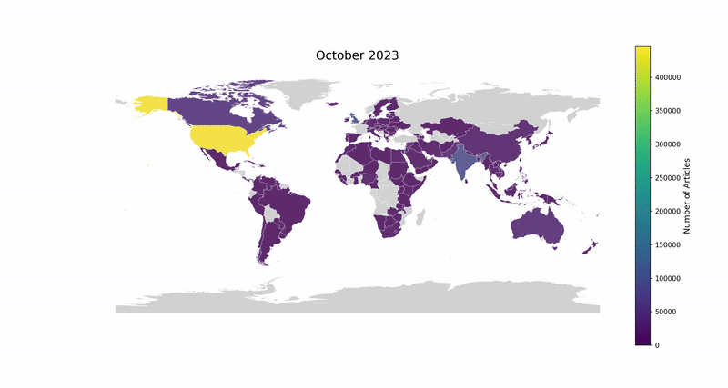

  
  <h1 align="center">  
      
     A Study on GDELT Media Representation of the Palestine-Israel Conflict
  </h1>  

  <h3>Developed with the packages and tools below 🛠️</h3>  

  
  
    
      
      
      
      
      
      
      
      
      
      
      
  
  

    
    
    
    

